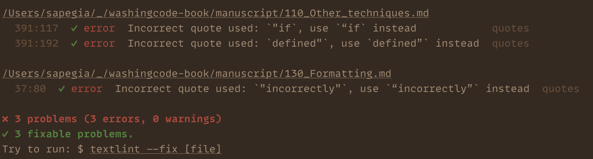

# textlint-rule-quotes

[](https://textlint.github.io/) [](https://github.com/textlint-rule-quotes/sapegin.me/actions) [](https://www.npmjs.com/package/textlint-rule-quotes)

[Textlint](https://github.com/textlint/textlint) rule to check and fix correct usage of quotes and replace straight quotes (`"`) with proper quotes (`“”`).



[](https://sapegin.me/book/)

## Installation

First, install from npm:

```shell
npm install textlint-rule-quotes
```

Then enable the rule in your `.textlintrc`:

```js
{
  "rules": {
    "quotes": true
  }
}
```

Read more about [configuring textlint](https://github.com/textlint/textlint/blob/master/docs/configuring.md).

## Usage

```shell
textlint --fix --rule quotes Readme.md
```

## Other textlint rules

- [textlint-rule-diacritics](https://github.com/sapegin/textlint-rule-diacritics) — words with diacritics
- [textlint-rule-apostrophe](https://github.com/sapegin/textlint-rule-apostrophe) — correct apostrophe usage
- [textlint-rule-stop-words](https://github.com/sapegin/textlint-rule-stop-words) — filler words, buzzwords and clichés
- [textlint-rule-terminology](https://github.com/sapegin/textlint-rule-terminology) — correct terms spelling

## Change log

The change log can be found on the [Releases page](https://github.com/sapegin/textlint-rule-quotes/releases).

## Contributing

Bug fixes are welcome, but not new features. Please take a moment to review the [contributing guidelines](Contributing.md).

## Sponsoring

This software has been developed with lots of coffee, buy me one more cup to keep it going.

<a href="https://www.buymeacoffee.com/sapegin" target="_blank"></a>

## Authors and license

[Artem Sapegin](https://sapegin.me) and [contributors](https://github.com/sapegin/textlint-rule-quotes/graphs/contributors).

MIT License, see the included [License.md](License.md) file.
